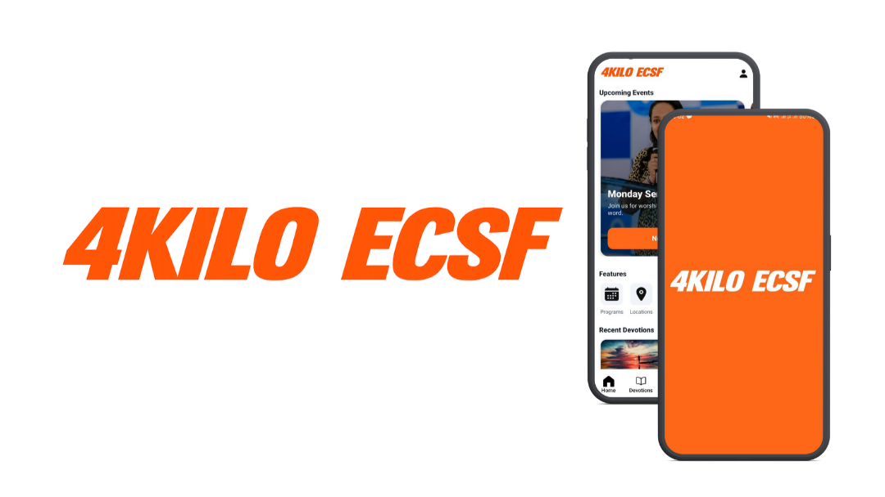

# My-Fellow

**My-Fellow** is a fellowship application built for the **AAU 4-Killo Evangelical Christian Students Fellowship (ECSF)**. It provides a centralized platform where students and leaders can access fellowship information, announcements, events, devotionals, and participation tools in one place.

## Overview

The app replaces scattered communication channels by offering real-time updates, clear event information, and structured fellowship resources. Members can stay informed, grow spiritually, and participate consistently, while leaders can communicate more effectively with the community.

## Features

My-Fellow includes fellowship and team information with meeting locations, real-time announcements, upcoming events with easy sharing and registration, daily devotionals, and digital giving through **Chapa payment integration** supporting banks and mobile wallets. The app also supports event posting, sharing, reminder notifications, and simple onboarding for new members.

## Contributing

This project is open source and community-driven. Contributors can fork the repository, create a feature branch, make improvements, and submit a pull request. Contributions should align with the fellowship’s mission and community values.

## License

MIT License
