# My Fellow

**My Fellow** is a comprehensive fellowship application designed for the **AAU 4-Killo Evangelical Christian Students Fellowship (ECSF)**. It serves as a centralized digital hub for students and leaders, providing instant access to fellowship schedules, announcements, devotionals, and community tools.

## Screenshots

  <table>
    <tr>
      <td></td>
      <td>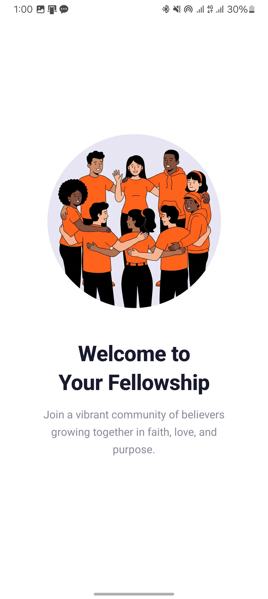</td>
      <td></td>
      <td>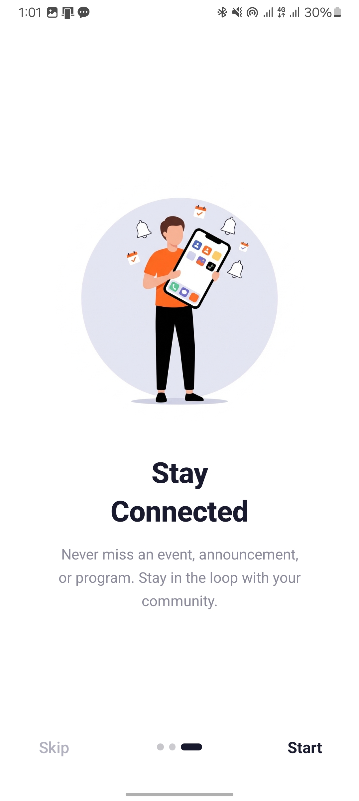</td>
    </tr>
    <tr>
      <td>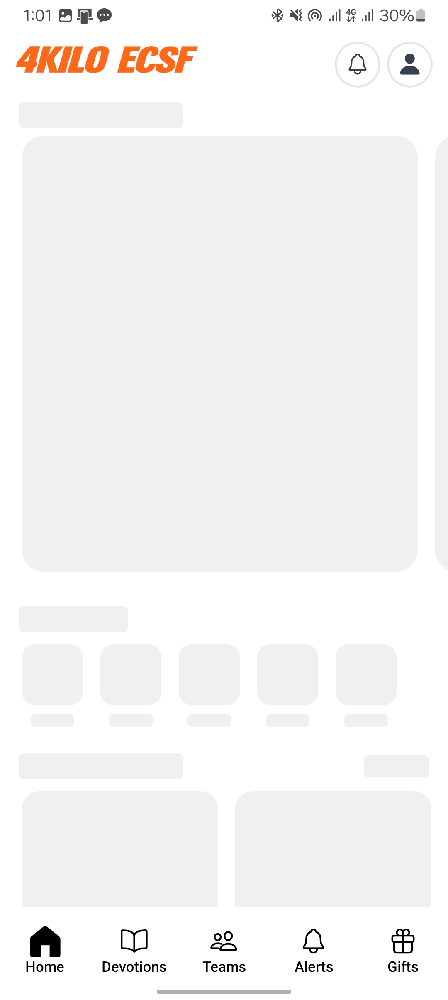</td>
      <td>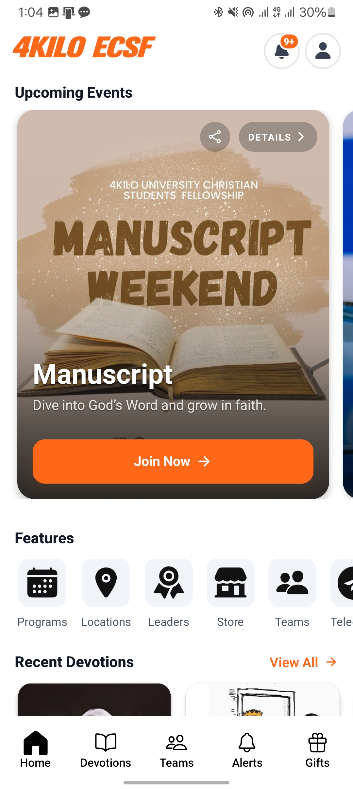</td>
      <td>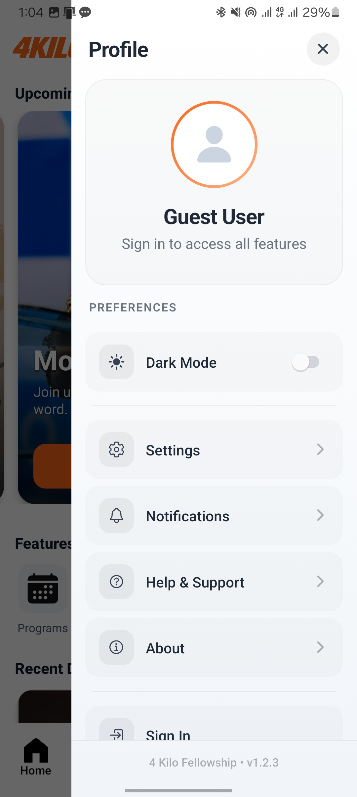</td>
      <td>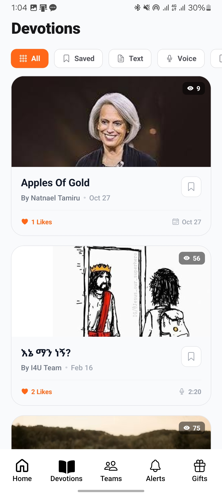</td>
    </tr>
    <tr>
      <td>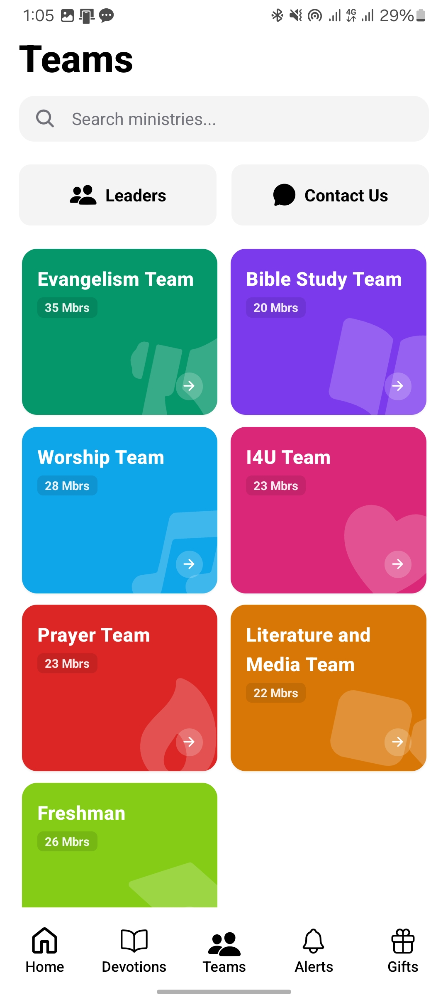</td>
      <td>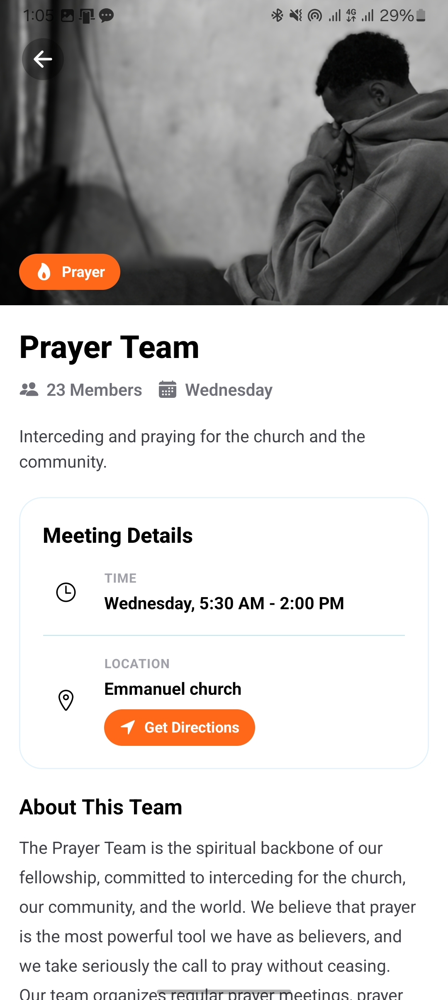</td>
      <td>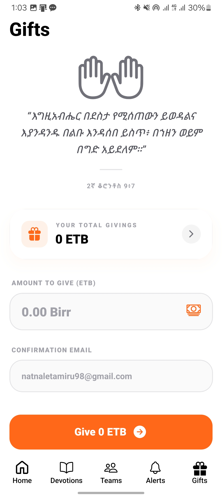</td>
      <td>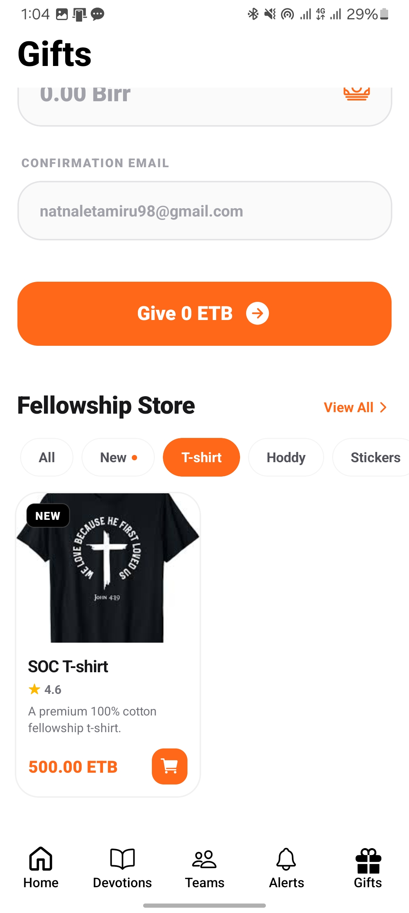</td>
    </tr>
    <tr>
      <td>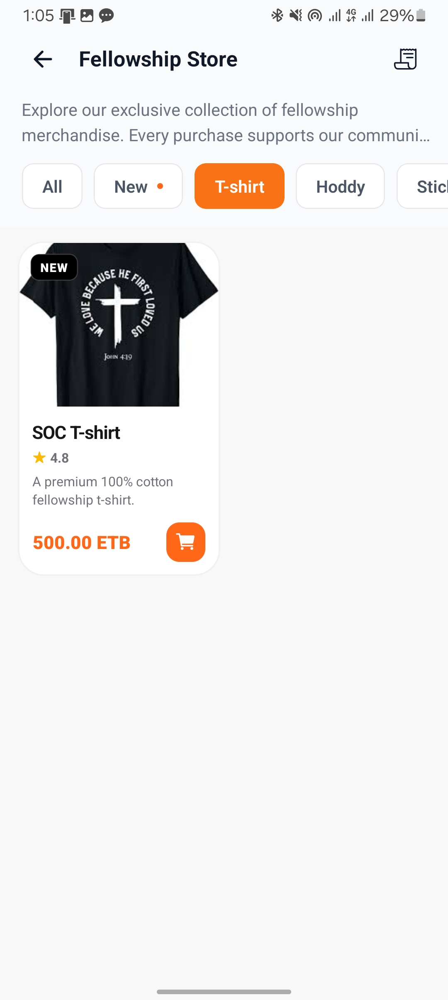</td>
      <td>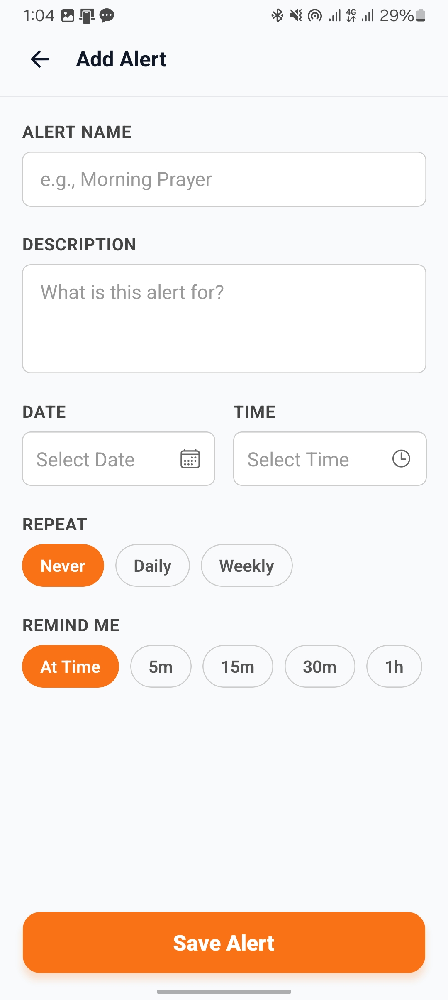</td>
      <td>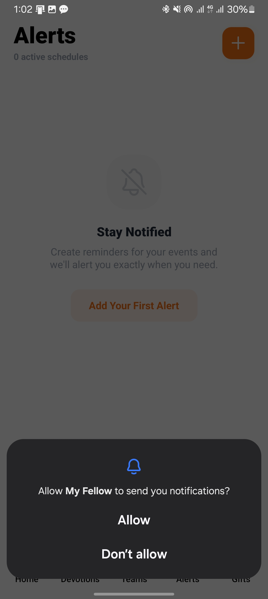</td>
      <td></td>
    </tr>
    <tr>
      <td colspan="4" align="center">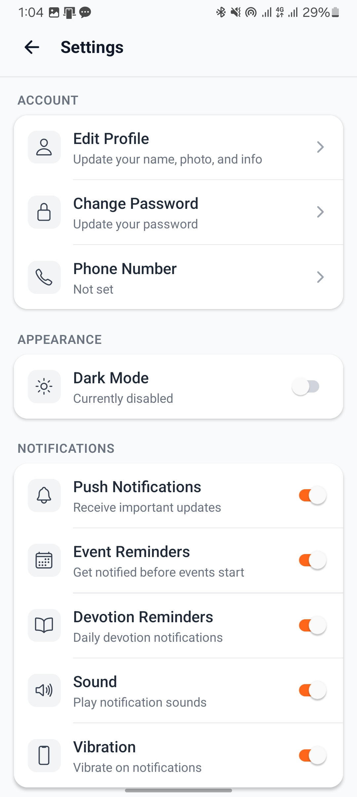</td>
    </tr>
  </table>

## Overview

The application modernizes fellowship communication by replacing fragmented channels with a unified platform. It offers real-time updates, structured resources, and interactive features to enhance spiritual growth and community engagement. Leaders benefit from streamlined communication, while members enjoy easy access to events and devotionals.

## Key Features

- **Real-time Announcements**: Stay updated with the latest news and notifications from the fellowship.
- **Event Management**: View upcoming events, register for participation, and share event details easily.
- **Daily Devotionals**: Access spiritual content and daily readings directly within the app.
- **Ministry Teams**: Explore various fellowship teams, their meeting locations, and membership details.
- **Digital Giving**: Securely contribute through integrated Chapa payment support for banks and mobile wallets.
- **Marketplace**: Browse and access fellowship-related products and resources.
- **Interactive Tools**: Features like event sharing, reminder notifications, and simple onboarding for new members.
- **Theming**: Full support for Dark and Light modes based on system preferences.

## Core Modules

### Authentication and User Management

- **Secure Authentication**: Traditional login and registration flows secured by Expo SecureStore.
- **User Profiles**: Manage personal information and fellowship affiliation (Team membership, past teams).
- **Onboarding**: A dedicated flow for new users to introduce them to the fellowship community.

### Content Delivery

- **Devotions Service**: Delivers daily spiritual content with offline support using local storage.
- **Events Service**: Handles event discovery, registration, and calendar integration.
- **Announcement System**: Real-time push notifications and in-app alerts for critical updates.

### Community and Fellowship

- **Team Management**: Allows users to find and join different ministry teams (e.g., Worship, Media, Welfare).
- **Leadership Directory**: Provides contact information and roles of the fellowship leaders.
- **Location Services**: Integrated maps and directions for meeting locations on campus.

### Marketplace and Payments

- **Marketplace Module**: A curated list of resources or products relevant to the student fellowship.
- **Payment Integration**: Secure transaction processing via Chapa, supporting local Ethiopian banking and mobile wallets.

## Tech Stack

- **Framework**: React Native with Expo (SDK 54)
- **Language**: TypeScript for type safety and better developer experience.
- **Styling**: NativeWind (Tailwind CSS) for responsive and maintainable UI design.
- **State Management**: Zustand for efficient, minimal-boilerplate global state.
- **Navigation**: Expo Router (File-based routing) for a web-like navigational structure.
- **Networking**: Axios for robust API requests and interceptors.
- **Form Handling**: React Hook Form with Zod validation for complex user inputs.
- **Storage**: AsyncStorage for general data and Expo SecureStore for sensitive credentials.
- **Payment Gateway**: Chapa Integration for seamless digital contributions.

## External Integrations

- **Telegram Bot**: Integration with the `I4U_TEAM_bot` for specialized guidance and member support.
- **Payment Providers**: Connectivity with Ethiopian banks and mobile money platforms (CBE, Telebirr, etc.) via Chapa.
- **Notification Services**: Push notification system to keep users engaged with live events.

## Project Structure

- `app/`: Primary application navigation and screen definitions using Expo Router.
- `components/`: Atomic and molecular UI components (Buttons, Inputs, Cards).
- `constants/`: Global style constants, theme definitions, and static configurations.
- `context/`: React context providers for global logic like Auth and Theme.
- `hooks/`: Custom workspace hooks for API calls, lifecycle events, and state mutations.
- `services/`: Specialized modules for external API calls and business logic processing.
- `stores/`: Zustand store files for state persistence across sessions.
- `types/`: Comprehensive TypeScript interfaces for API responses and application state.
- `utils/`: Utility functions for formatting, validation, and common helpers.
- `assets/`: Static assets including images, logos, and custom fonts.

## License

Distributed under the MIT License.
